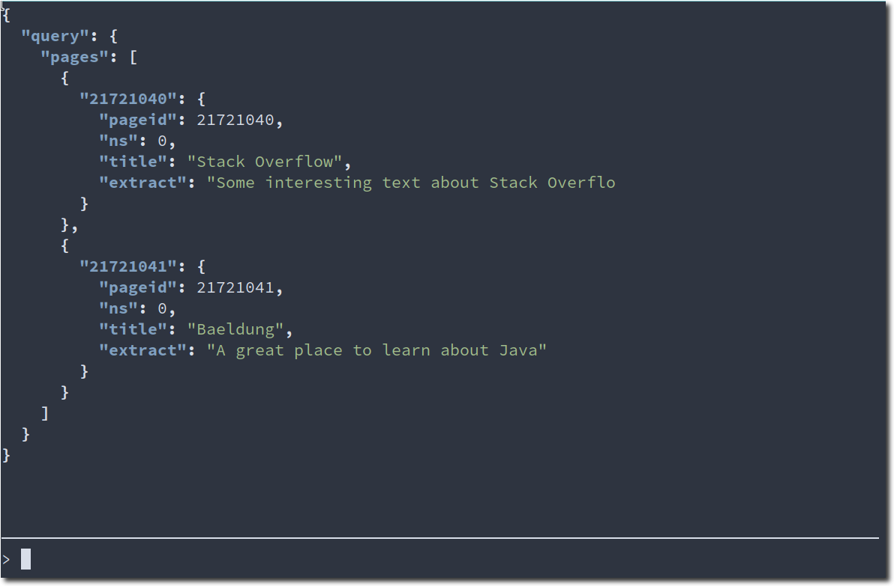
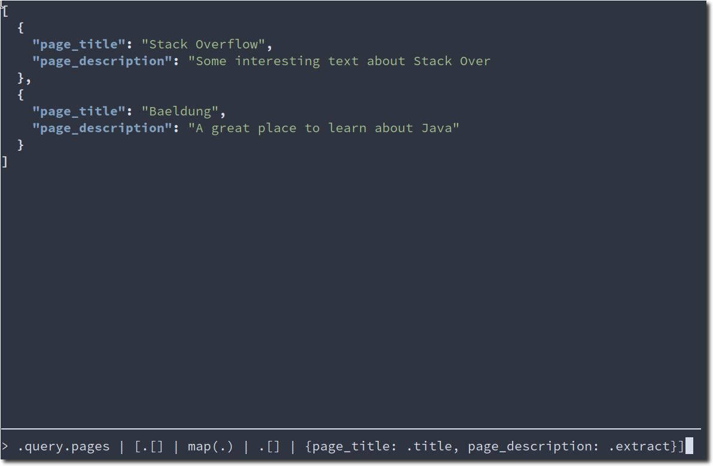

&mdash; *A REPL to play with.*

Wrap any command into a TUI, displaying its output in a scrollable area. Change
parts of the command, hit enter to re-run the command again. Repeat.

---

</div>

# Building

You can build this project using [Bazel](https://bazel.build/) on [NixOS](https://nixos.org/):

```console
$ bazel build replay
```

# Usage

## Synopsis

```console
$replay - interactive command line tool

Usage: replay [-v|--version] [-n|--var-name NAME] [-w|--watch FILE] 
              [-i|--from-stdin] COMMAND ARGS
  Repeatedly run a command and display its output.

Available options:
  -v,--version             output version information and exit
  -n,--var-name NAME       name of the variable to replace (default: "input")
  -w,--watch FILE          watch FILE and re-run command automatically if it
                           changes
  -i,--from-stdin          read input from stdin, pipe into program continually
  -h,--help                Show this help text
```

## Configuration

`replay` reads a config file in `ini` format from `~/.config/replay/config.ini` when it exists. This can be used to define defaults for specific commands.

Its format is like this:
```ini
; a section is matched from the command given on the command line
[cmd]
;; arguments that will be prepended to the arguments given on the command line
args = --default --arguments --query={input}
;; command to run instead of the command given on the command line
command = foocmd
;; the prompt to show before the text input
prompt = $
;; the default input of the command
input = help
```

## Example

```console
$ replay jq --color-output input -r wikipedia.json
```



This command executes the [jq](https://stedolan.github.io/jq/) tool and displays the output in a text area. Editing the expression in the input field and hitting <kbd>Enter</kbd> re-runs the command and displays the new output.



Pressing <kbd>Esc</kbd> exits the program, and prints the last output to stdout.
